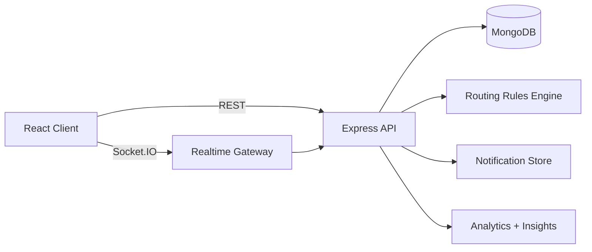

# ARTIFICIX - Centralized Order Management System

Hackathon-ready full-stack OMS with:
- Multi-channel order intake (`website`, `admin`, `whatsapp`, `pos`)
- Smart routing rules (warehouse, priority, fragile handling)
- Real-time updates via Socket.IO
- Live dashboard + analytics
- Heuristic "Smart Insights" panel for quick operational decisions

## 1-Minute Judge Setup

From project root:

```bash
npm run judge:start
```

This does:
1. installs all dependencies (root + server + client)
2. creates `.env` files from examples (if missing)
3. starts MongoDB via Docker
4. runs server + client

App URLs:
- Frontend: `http://localhost:5173`
- API health: `http://localhost:4000/api/health`

## Manual Setup (If needed)

```bash
# project root
npm run setup
npm run db:up
npm run dev
```

If Docker is not available, install MongoDB and set `MONGODB_URI` in `server/.env`.

## Environment Variables

### `server/.env`
```env
PORT=4000
MONGODB_URI=mongodb://127.0.0.1:27017/oms
CLIENT_URL=http://localhost:5173
```

### `client/.env`
```env
VITE_API_URL=http://localhost:4000
```

## Demo Flow (for judges)

1. Open Dashboard (`/`) and click **Mock: delayed alert** (toast demo)
2. Go to **Intake**, create an order (try fragile + high total)
3. Return to Dashboard and watch realtime table update
4. Open **Analytics** for revenue + hourly chart + top products
5. Open **Track** and search using order number
6. Open two tabs to observe live updates and notifications

## Architecture



## API Highlights

- `GET /api/health` - health check
- `POST /api/orders` - create order
- `GET /api/orders` - list/filter orders
- `PATCH /api/orders/:id/status` - controlled status progression
- `POST /api/orders/generate-samples` - generate demo dataset
- `GET /api/analytics/summary` - KPI and chart metrics
- `GET /api/analytics/insights` - heuristic smart insights
- `POST /api/integrations/whatsapp/mock` - mocked integration endpoint
- `GET /api/integrations/whatsapp/auto-replies` - recent simulated outbound WhatsApp messages
- `GET /api/notifications` - recent notifications

### WhatsApp automatic replies (demo)

For orders with a customer phone number, the API auto-generates WhatsApp template-style messages when:

1. An order is created (confirmation + total)
2. Status is advanced (`PATCH /api/orders/:id/status`) — customer gets a short update

This is a **mock** (logged + Socket.IO `whatsapp:reply`) and includes a ready `wa.me` link per message. For production, swap the implementation in `server/src/lib/whatsappAutoReply.ts` with [Meta WhatsApp Cloud API](https://developers.facebook.com/docs/whatsapp/cloud-api) (send message + optional webhook for inbound).

Set `WHATSAPP_AUTO_REPLY_ENABLED=false` in `server/.env` to turn auto-replies off.
Set `WHATSAPP_ADMIN_NUMBER=9209818840` to define the admin sender number. Customer phone entered in `phone` is used as the recipient.

## Why this is hackathon-friendly

- Fast local startup (`judge:start`)
- Clear env + setup instructions
- Real-time, visible system behavior
- Practical automation logic (routing + insights)
- Architecture and demo flow documented end-to-end
